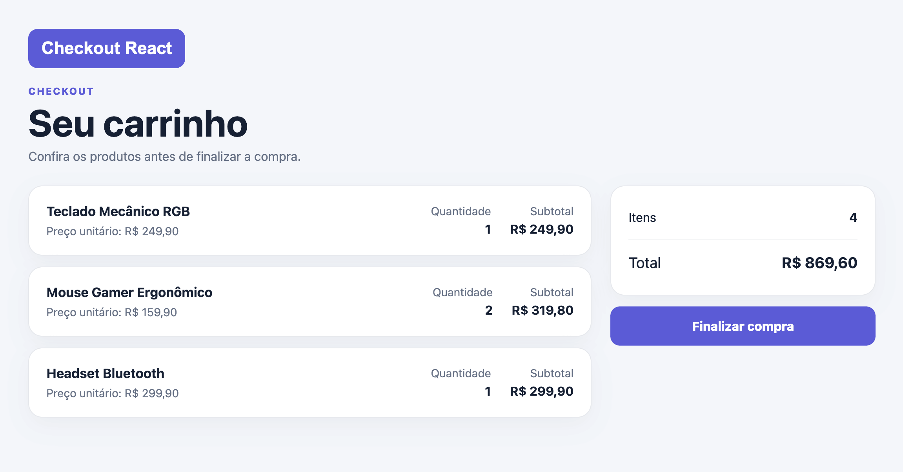

# Checkout React

Mini-Projeto Avaliativo - Módulo 2.

O checkout-react é uma aplicação de checkout desenvolvida com React e Vite, simulando a experiência de finalização de uma compra em uma loja virtual.

## Sobre o Projeto
A aplicação utiliza um carrinho fixo representado por um array de produtos e componentes reutilizáveis para exibição dos itens, quantidades, subtotais e valor total da compra. O usuário pode navegar entre as etapas do checkout por meio do React Router.

O pagamento é realizado por meio de um formulário construído com React Hook Form e Zod, com validação dos dados informados. Após o envio, o pagamento é simulado de forma assíncrona no navegador, exibindo o estado de processamento e direcionando o usuário para uma tela de sucesso ou falha conforme a regra de segurança definida no projeto.

O projeto também conta com tratamento de estados, eventos, validações, navegação entre páginas, acessibilidade básica, layout responsivo e estilização em CSS.

## Funcionalidades do Projeto
- Exibição do carrinho com produtos, quantidades, subtotais e total.
- Formulário de pagamento com validação usando React Hook Form e Zod.
- Simulação de pagamento assíncrona com mensagem de processamento.
- Tela de pagamento aprovado.
- Tela de falha para tentativa de golpe.
- Navegação entre as etapas com React Router.
- Interface responsiva e com acessibilidade básica.
- Estilização utilizando CSS.

## Tecnologias Utilizadas

- React
- Vite
- React Router
- React Hook Form
- Zod
- @hookform/resolvers
- CSS responsivo


## Conceitos Aplicados
- Componentes funcionais e reutilizáveis
- JSX e Props
- useState e gerenciamento de estado
- Eventos e formulários
- React Hook Form e Zod
- React Router
- Arrays, objetos e funções
- map() e key para listas
- Hooks e custom hook
- Validação de dados
- Simulação assíncrona

## Interface

- Layout moderno e simples para checkout
- Logo e identidade visual própria
- Cards para produtos, resumo e pagamento
- Formulário organizado e responsivo
- Feedback visual durante o processamento
- Telas distintas para sucesso e falha
- Design adaptado para desktop e dispositivos móveis
- Acessibilidade e foco em usabilidade
- Estilização com CSS


## Estrutura do Projeto

```
checkout-react/
├── package.json                    # dependências e scripts do Vite
├── vite.config.js                  # configuração do Vite
├── README.md                       # documentação e instruções de execução
└── src/
    ├── main.jsx                    # ponto de entrada da aplicação
    ├── App.jsx                     # configuração das quatro rotas
    ├── pages/
    │   ├── Carrinho.jsx            # produtos, subtotais e total da compra
    │   ├── Pagamento.jsx           # formulário com React Hook Form e Zod
    │   ├── Sucesso.jsx             # confirmação da compra
    │   └── Falha.jsx               # mensagem "tentativa de golpe"
    ├── components/
    │   ├── ItemCarrinho.jsx        # exibição de um produto via props
    │   └── ResumoCompra.jsx        # resumo dos valores da compra
    ├── hooks/
    │   └── usePagamento.js         # estado e processamento da compra simulada
    ├── utils/
    │   └── pagamento.js —          # regra que identifica dígitos todos iguais
    ├── data/
    │   └── produtos.js —           # array fixo de produtos
    └── assets/
        ├── styles/
        │   └── index.css           # estilos e responsividade
        └── img/
            └── logo.svg            # identidade visual da loja
```


## Instalação

```bash
npm install
npm run dev
```

Depois, abra o endereço exibido pelo Vite no navegador.

## Build

```bash
npm run build
npm run preview
```

## Fluxo

- `/` — resumo do carrinho
- `/pagamento` — formulário de pagamento
- `/sucesso` — compra aprovada
- `/falha` — tentativa de golpe

## Passo a passo na interface

1. **Carrinho:** o usuário visualiza os produtos, quantidades, subtotais e valor total.

2. **Finalização:** clica em “Finalizar compra” para acessar o pagamento.

3. **Pagamento:** preenche nome do titular, número do cartão, validade e CVV.

4. **Validação:** o sistema verifica os dados antes de prosseguir.

5. **Processamento:** aparece “Processando compra...” enquanto a simulação é realizada.

6. **Resultado:** o usuário é direcionado para a tela de compra aprovada ou tentativa de golpe.

7. **Navegação:** é possível retornar ao carrinho ou tentar o pagamento novamente.

## Regra da simulação
- O pagamento é realizado apenas no navegador, sem backend ou serviço de pagamento.
- Cartões com 16 dígitos são considerados válidos para a simulação.
- Se os 16 dígitos forem iguais, o pagamento é recusado e direcionado para a tela de falha.
- Caso contrário, o pagamento é aprovado e direcionado para a tela de sucesso.
- O processamento é simulado de forma assíncrona, exibindo “Processando compra...”.

## checkout — Interface

[](https://checkout-react-six.vercel.app/)


## Demonstração: Projeto checkout-react

🔗 [Vercel (Deploy)](https://checkout-react-six.vercel.app/)

---

## Estratégia de Branches Git

O projeto utiliza uma estratégia simples de branches para organizar o desenvolvimento e manter a branch principal estável.

* `develop` — branch principal de desenvolvimento e integração das funcionalidades.
* `feature/*` — branches utilizadas para desenvolver funcionalidades específicas.
* Após a conclusão de uma funcionalidade, as alterações são integradas à `develop`.
* Commits são realizados de forma descritiva, identificando claramente as alterações feitas.


### Features criadas

* `feature/modelos-e-dados` — criação dos modelos e dados dos produtos do carrinho.
* `feature/formulario-pagamento` — implementação do formulário de pagamento e suas validações.
* `feature/readme` — criação e organização da documentação do projeto no README.


## Links do Projeto

- 🔗 [Vercel (Deploy)](https://checkout-react-six.vercel.app/)
- 🔗 [Repositório GitHub](https://github.com/marcelfcampos/checkout-react)
- 🔗 [Trello (Kanban)](https://trello.com/invite/b/6aa718343ab60e9456f4273c/ATTI678e0daff6f5cbc5bb6c442bfee95c0705FA46B6/checkout-react)

## Redes Sociais

- 🔗 [LinkedIn](https://www.linkedin.com/in/marcelfcampos/)
- 🔗 [Instagram](https://www.instagram.com/arqmarcelcampos/)
- 🔗 [GitHub](https://github.com/marcelfcampos)


## Checklist Final de Entrega

- ☑ Repositório privado no GitHub, com mentor/operação adicionados.
- ☑ A aplicação React roda com os comandos documentados no README
- ☑ Carrinho fixo com pelo menos três produtos, subtotais e total em reais
- ☑ Quatro páginas com React Router: carrinho, pagamento, sucesso e falha
- ☑ Formulário com React Hook Form e Zod, campos obrigatórios e erros de formato
- ☑ Cartão com todos os dígitos iguais leva à falha com "tentativa de golpe"
- ☑ Demais cartões com formato aceito levam à tela de sucesso
- ☑ Processamento assíncrono com mensagem e botão desabilitado
- ☑ Componentes reutilizáveis com props, lista com key, useState e custom hook
- ☑ HTML semântico em JSX, rótulos, foco e feedback acessível
- ☑ Responsivo mobile-first, testado no DevTools
- ☑ Array local ou API; se houver API, carregamento, vazio e erro tratados
- ☑ Código organizado em módulos e investigação com debugger relatada
- ☑ Sem Context API, back-end ou pagamento real; dados fictícios do cartão sem persistência
- ☑ Branches + commits descritivos (>=8) mergeados na main
- ☑ Trello público com os cartões + link no README
- ☑ README completo (5.2)
- ☐ Vídeo (≤7 min) no Google Drive com permissão por link.
- ☑ Links enviados no AVA antes do prazo


## Autor

**Marcel Ferreira Campos**

Formado em Arquitetura e Urbanismo, trago para a área de tecnologia a combinação entre pensamento criativo e estruturado, aplicando conceitos de design, usabilidade e lógica construtiva ao desenvolvimento de interfaces digitais.